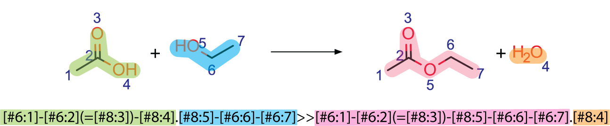
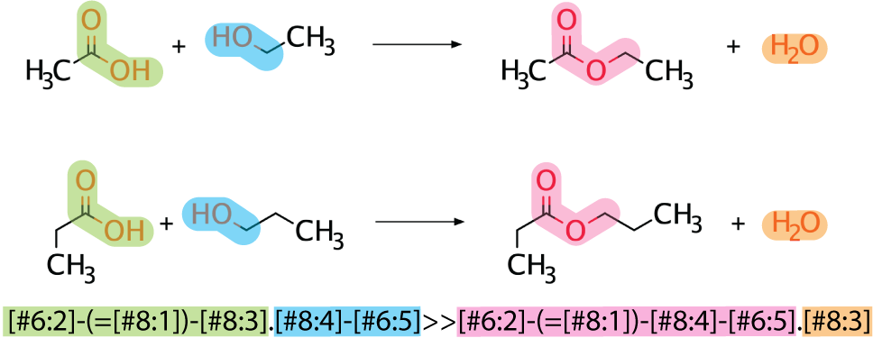
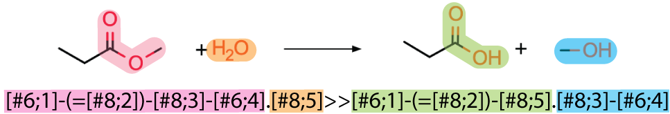

Generating Pickaxe Inputs
=========================

Compound Inputs
---------------
Pickaxe takes a few input files to specify compounds and rules for the expansion. One group of these
files are simply compounds, some of which are required and others are option, depending on the
desired functionality of a given Pickaxe run.

Required:

#. Compounds to react.

Optional:

#. Targets to filter for.
#. Metabolomic data to filter with (see **met_data_path** parameter in :ref:`Built-In Filters`).

Compound Input
~~~~~~~~~~~~~~
Pickaxe accepts a .csv or a .tsv that consists of two columns, an `id` field and a `structure` field. 
The `id` field is used to label the final output and the structure field consists of 
SMILES representation of compounds.

Here is an example of a valid compound input file::

    id,SMILES
    glucose,C(C1C(C(C(C(O1)O)O)O)O)O
    TAL,C/C1=CC(\O)=C/C(=O)O1

Target Input
~~~~~~~~~~~~
The target compound input file takes the same form as the input compounds.::

    id,SMILES
    1,C=C(O)COCC(C)O

Reaction Operator Inputs
-------------------------
There are two files required for the application of reactions:

#. Reaction operators to use.
#. Coreactants required by the reaction operators.

Default rules are supplied with pickaxe, however custom rules can be written and used.

Default Rules
~~~~~~~~~~~~~
Overview
********
A set of biological reaction rules and cofactors are provided by default. These consist of approximately 70,000 MetaCyc
reactions condensed into generic rules. Selecting all of these rules will result in a large expansion,
but they can be trimmed down significantly while still retaining high coverage of MetaCyc reactions.

+-----------------+---------------------+
| Number of Rules | Percent Coverage of |
|                 | MetaCyc Reactions   |
+-----------------+---------------------+
| 20              | 50                  |
+-----------------+---------------------+
| 100             | 78                  |
+-----------------+---------------------+
| 272             | 90                  |
+-----------------+---------------------+
| 500             | 95                  |
+-----------------+---------------------+
| 956             | 99                  |
+-----------------+---------------------+
| 1221            | 100                 |
+-----------------+---------------------+

Additionally, a set of intermediate reaction rule operators are provided as well. These
operators are less generalized than the generalized ruleset and provide uniprot information
for each operator.

Generating Default Rule Inputs
******************************
Default rules are imported from the rules module of minedatabase and have a few options
to specify what is loaded:
    #. Number of Rules
    #. Fractional Coverage of MetaCyc
    #. Anaerobic Rules only
    #. Groups to Include
    #. Groups to Ignore

Possible groups to ignore and include are: aromatic, aromatic_oxygen, carbonyl, nitrogen,
oxygen, fluorine, phosphorus, sulfur, chlorine, bromine, iodine, halogen. Examples of Defining
rules are given below.

The provided code returns the rule_list and coreactant_list that is passed to the pickaxe object.

Generalized Rules Mapping 90% Metacyc
*************************************
.. code-block:: python

    from minedatabase.rules import metacyc_generalized
    rule_list, coreactant_list, rule_name = metacyc_generalized(
        fraction_coverage=0.9
    )

Generalized Rules with 200 Anaerobic and Halogens
*************************************************
.. code-block:: python

    from minedatabase.rules import metacyc_generalized
    rule_list, coreactant_list, rule_name = metacyc_generalized(
        n_rules=200
        anaerobic=True,
        include_containing=["halogen"]
    )

Intermediate Rules with all Halogens except Chlorine
****************************************************
.. code-block:: python

    from minedatabase.rules import metacyc_intermediate
    rule_list, coreactant_list, rule_name = metacyc_intermediate(
        include_containing=["halogen"],
        exclude_containing=["chlorine"]
    )

Generating Custom Rules
~~~~~~~~~~~~~~~~~~~~~~~
In the event that the default rules do not contain a reaction of interest, it is pososible
to generate your own rules. Outlined below is the process to generate rules for esterification reactions, which consists
of three parts

#. Writing the reaction SMIRKS.
#. Writing the reaction rule.
#. Writing the coreactant list.

Writing Reactiton SMIRKS
************************
Rules are generated using `reaction SMIRKS <https://daylight.com/dayhtml/doc/theory/theory.smirks.html>`_
which represent reactions in a string. Importantly, these reaction rules specify atom mapping,
which keeps track of the species throughout the reaction. To higlight a simple reaction rule generation,
a deesterification reaction will be used.

The reaction SMIRKS is highighted the same color as the corresponding molecule in the reaction above.
Ensuring correct atom mapping is important when writing these rules. This is an exact reaction rule 
and it matches the exact pattern of the reaction, which is not useful as it will not match many molecules. 

Instead of using an exact reaction, a generic reaction rule can be used to match more molecules. In this case,
the radius of the atom away from the reactive site is decreased.

Writing Reaction Rules
**********************
With the reaction SMIRKS written, now the whole rule for Pickaxe must be written. The rules are written
as follows in a .tsv::

    RULE_ID REACTANTS   RULE    PROODUCTS   NOTES

The rule_id is an arbitrary, unique value, the reactants and products specify how many compounds a rule
should be expecting, and the rule is the reaction SMIRKS. Notes can be provided, but have no effect
on the running of Pickaxe. The reactants and products are specified as a generic compound, "Any", or
as a predefined coreactant.

Below is an example of a reaction rule made for a deesterification reaction.

::

    RULE_ID REACTANTS   RULE    PROODUCTS   NOTES
    rule1   Any;WATER     [#6:2]-(=[#8:1])-[#8:4]-[#6:5].[#8:3]>>[#6:2]-(=[#8:1])-[#8:3].[#8:4]-[#6:5]    Any;Any

.. note::
    Currently only one "Any" is allowed as a reactant and any other reactant must be
    defined as a coreactant.

Defining Coreactants
********************
Coreactants are defined in their own file that the Pickaxe object will load and use
alongside the reaction rules. The coreactant file for the example deesterification reaction
is::

    #ID Name    SMILES
    WATER	WATER	O

Reaction Rule Example Summary
*****************************

Summarized here is the input files for a deesterification reaction.

**Reaction**

**Reaction Rule Input**

::

    RULE_ID REACTANTS   RULE    PROODUCTS   NOTES
    rule1   Any;WATER     [#6:2]-(=[#8:1])-[#8:4]-[#6:5].[#8:3]>>[#6:2]-(=[#8:1])-[#8:3].[#8:4]-[#6:5]    Any;Any

**Coreactant Input**

::

    #ID Name    SMILES
    WATER	WATER	O